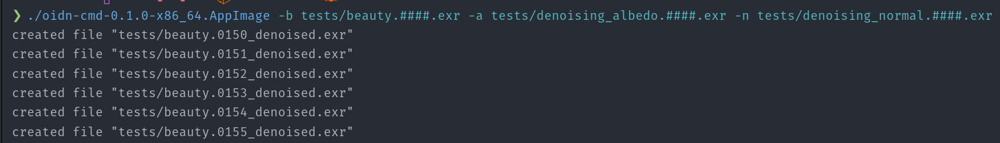

# oidn-cmd


- Is aiming to be a simple command line utility for denosiing **.exr** sequences using [**Intel Open Image Denoise**](https://www.openimagedenoise.org/).
- For Linux appimage is provided, which should work out of the box.
- For Windows and MacOS building should via cargo *should* work, but I did not test it yet.

## Limitations
- The denoised .exr file contains only the denoised layer, other layers from the original file are stripped.

## Arguments
```bash
  -b, --beauty <beauty>            a beauty .exr file or sequence using the foo.####.exr pattern
  -a, --albedo <albedo>            a albedo .exr file or sequence using the foo.####.exr pattern
  -n, --normal <normal>            a normal .exr file or sequence using the foo.####.exr pattern
  -e, --layerbeauty <layerbeauty>  OPTIONAL - name of layer to denoise inside the beauty exr, defaults to main_layer
  -l, --layeralbedo <layeralbedo>  OPTIONAL - name of layer to denoise inside the albedo exr, defaults to main_layer
  -o, --layernormal <layernormal>  OPTIONAL - name of layer to denoise inside the normal exr, defaults to main_layer
  -x, --license                    Print license information
  -h, --help                       Print help
  -V, --version                    Print version
```
## Running the .appimage
- download and make it executable
- run via commandline:

```bash
./oidn-cmd-0.1.0-x86_64.AppImage -b tests/beauty.####.exr -a tests/denoising_albedo.####.exr -n tests/denoising_normal.####.exr
```

## Running & building via cargo
- clone
- download and extract OIDN into *include/oidn-2.2.2.x86_64.linux/*
- build / run:

```bash
cargo run --release -- -b tests/beauty.####.exr -a tests/denoising_albedo.####.exr -n tests/denoising_normal.####.exr
```

## Building the Appimage (Linux only)
- same steps as for cargo
- download the  [appimage-builder](https://github.com/AppImageCrafters/appimage-builder/releases) and make it exectuable, I also tend to remove the .AppImage in the file name.
- you can put it to e.g. /home/your-user/.local/bin/ to have it available everywhere.
- cd into oidn-cmd directory and run *appimage-builder*

## Acknowledgements
- Will Usher - creator of [oidn-rs](https://github.com/Twinklebear/oidn-rs) crate
- Johannes Vollmer - creator of [exrs](https://github.com/johannesvollmer/exrs) crate

## License
This repository is licensed under MIT license. 

The .appimage release contains unaltered files of Intel® Open Image Denoise release, 
which is licensed under Apache License Version 2.0, 

see https://github.com/RenderKit/oidn/blob/master/LICENSE.txt for more information.